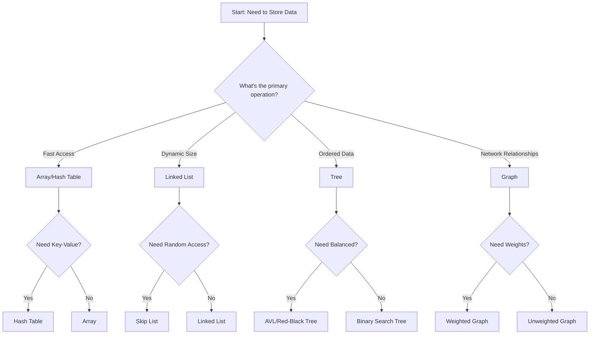

# Understanding Data Structures: A Journey Through Code Organization

## Why Data Structures Matter

Imagine you're building a library. You could throw all the books in a pile, but finding a specific book would be a nightmare. This is exactly why we need data structures in programming - they help us organize and access data efficiently.

## The Data Structure Decision Flowchart

## Common Data Structures and Their Use Cases

### 1. Arrays
- **Best for**: Fixed-size collections with random access
- **Example**: Storing student grades in a class
- **Time Complexity**: O(1) for access, O(n) for insertion/deletion

### 2. Linked Lists
- **Best for**: Dynamic collections with frequent insertions/deletions
- **Example**: Implementing an undo feature in a text editor
- **Time Complexity**: O(1) for insertion/deletion, O(n) for access

### 3. Hash Tables
- **Best for**: Key-value storage with fast lookups
- **Example**: User authentication system
- **Time Complexity**: O(1) average case for all operations

### 4. Trees
- **Best for**: Hierarchical data and sorted collections
- **Example**: File system organization
- **Time Complexity**: O(log n) for balanced trees

### 5. Graphs
- **Best for**: Network relationships and path finding
- **Example**: Social network connections
- **Time Complexity**: Varies based on implementation

## Real-World Applications

### Social Media Platforms
- **Graphs**: Represent user connections
- **Hash Tables**: Store user profiles
- **Trees**: Organize comments and replies

### E-commerce Websites
- **Arrays**: Product listings
- **Hash Tables**: Shopping cart
- **Trees**: Category navigation

### Operating Systems
- **Linked Lists**: Process scheduling
- **Trees**: File system
- **Hash Tables**: Memory management

## Performance Considerations

When choosing a data structure, consider:
1. **Access Patterns**: How will you access the data?
2. **Memory Usage**: How much space do you need?
3. **Operation Frequency**: Which operations are most common?
4. **Data Size**: How much data will you store?

## Best Practices

1. **Start Simple**: Begin with basic structures (arrays, lists)
2. **Profile First**: Measure performance before optimizing
3. **Consider Trade-offs**: Every structure has pros and cons
4. **Think Scalability**: Will your choice work with more data?

## Common Pitfalls to Avoid

1. Using arrays for frequent insertions/deletions
2. Choosing complex structures when simple ones suffice
3. Ignoring memory constraints
4. Not considering worst-case scenarios

## Next Steps

Ready to dive deeper? Check out our:
- [Stack Data Structure Guide](/docs/stack)

Remember: The best data structure is the one that solves your specific problem efficiently. Don't overcomplicate things - start simple and optimize when needed. 